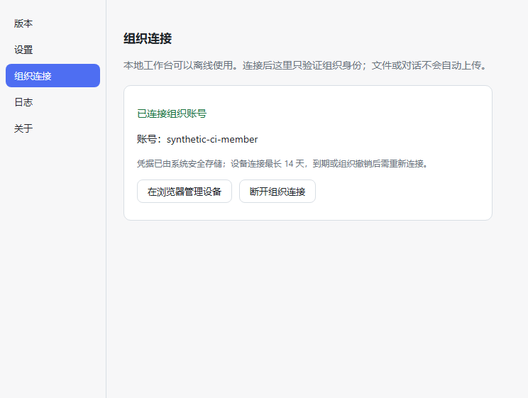

# Windows 组织连接：隔离测试安装包验收

本流程只用于本机合成账号验收。标准安装包的 Gateway 固定为
`https://ds.ainativeorg.net`；测试安装包在构建时固定到 Windows 本机的
`http://127.0.0.1:47621`，运行时不能修改地址。测试安装包的显示名、
`appId`、Windows AppUserModelId、用户数据与日志目录均和标准版分开。
测试安装包产物是 `dist-win-test/DSH-GUI-Test-Setup-0.2.1-x64.exe`，
不得作为公开 Release 发布。

## CI 候选与证据（2026-09-25）

[CI run 36036192943](https://github.com/ln9527/deepseek-harness-gui/actions/runs/36036192943)
在提交 `507ecb62a40cca2c5c5e9467a6dfc014810b3ec9` 上完成：macOS
测试、标准 Windows 测试与安装包、测试专用 Windows 安装包三个 job 均通过。
标准 Windows job 的 Vitest 为 114 通过、1 跳过，原生 GLM 测试 8/8
通过，且生成并上传了标准 NSIS 安装包。

本次 Windows 人工验收请取该 run 的
[DSH-GUI-Test-Setup-win-x64-TEST-ONLY artifact](https://github.com/ln9527/deepseek-harness-gui/actions/runs/36036192943/artifacts/10825232065)
（14 天保留）。其中 EXE 文件名为
`DSH-GUI-Test-Setup-0.2.1-x64.exe`，Windows runner 用 `Get-FileHash`
记录的 EXE SHA-256 为
`c7bfc5951933f8d5ef0fb7dea6dc43d298aeb376ca0a2c0738416e0a57587b24`。
GitHub 上传归档的 SHA-256 为
`630e8906a4c5375755cddd6bb08f801aeec34652b8e3560afac20c8dcd3000b1`。
这个候选只证明 Windows CI 构建和自动测试通过；尚未在 Windows
桌面上完成以下浏览器批准、重启、撤销、拒绝、过期与离线交互验收。

## 打包界面的自动检查

测试专用 Windows job 在临时 runner 上分别启动打包目录的
`win-unpacked/DSH GUI Test.exe`，以及把同一测试版 NSIS 以 `/S`
静默安装到 `%TEMP%` 后的 `DSH GUI Test.exe`。两次都连接固定端口
47621 的本机协议夹具。Playwright 通过 Electron 调试接口打开真实管理窗、点击连接、
读取连接码；夹具用该码批准合成账号。随后检查已连接界面、系统加密
凭据保存、退出并重启后的 `/me` 重验，以及模拟组织撤销后重入账号页
清除本地凭据。测试版的应用数据与 DSH_HOME 均在临时目录；NSIS
安装路径也固定到临时目录，测试结束运行静默卸载并清理。成功时分别
保存不含 token 的已连接界面截图。

静默安装只验证安装后的可执行文件及同一管理窗流程，不覆盖有人参与的
安装页面、快捷方式或卸载界面。浏览器批准动作由夹具模拟，并未操作真实 Gateway 网页。真实 Gateway
的 HTTP 协议由跨仓 `gateway-contract.test.ts` 单独检查（有 Gateway 源码时
运行）。CI 的桌面检查通过后，仍需按下文用该 run 的 NSIS 安装包在
Windows 桌面完成真实浏览器批准、拒绝、过期、离线与可见安装/卸载验收。
[首次 Windows 探针 run 36038815617](https://github.com/ln9527/deepseek-harness-gui/actions/runs/36038815617)
中，未安装版的连接、保存、重启和撤销断言都通过，job 最后因测试夹具
把 Edge 的缓存放进临时目录，Windows 文件锁阻止目录清理而失败。
随后夹具改为只重定向本应用的数据与 DSH_HOME，并通过了下一次运行的
未安装版步骤。

[第二次 Windows 探针 run 36039856360](https://github.com/ln9527/deepseek-harness-gui/actions/runs/36039856360)
中，macOS、标准 Windows 和测试版 `win-unpacked` 界面步骤均通过；后者在
真实 Windows runner 上完成了合成账号连接、加密保存、退出重启后 `/me`
验证及撤销后清除本地凭据。下图是该次运行的真实管理窗截图，账号为
临时合成账号，画面不含设备 token：



同一次 run 的静默 NSIS 安装在 `/S /D=<临时目录>` 命令上达到 120 秒
超时，安装后的 UI 流程并未运行。新的诊断尝试关闭安装器的继承输出管道、
限定 180 秒，并在超时时记录临时安装目录是否出现可执行文件；只有下一次
Windows CI 通过后，才能把静默安装版计为已验证。

## 在测试 Windows x64 机器准备

需要 Node.js 24、pnpm 10、此 GUI 仓库和含桌面设备认证的 Gateway 仓库。
Gateway 仓库先按自身说明安装 `gateway/` 依赖。本机端口 47621 应空闲。
在 GUI 仓库的 PowerShell 7 终端运行：

```powershell
$env:DSH_GATEWAY_SOURCE = 'C:\path\to\dsh-agent-core'
$env:DSH_GUI_TEST_GATEWAY_ORIGIN = 'http://127.0.0.1:47621'
$env:DSH_GUI_TEST_PASSWORD = Read-Host -MaskInput 'Choose a throwaway synthetic password'
pnpm install --frozen-lockfile
pnpm dist:win:test
```

构建脚本只接受精确的 loopback HTTP origin，且编译后的主进程必须含有
`DSH GUI Test` 和指定地址，否则拒绝打包。标准 `pnpm dist:win` 不需要
上述测试变量；发布时须从干净环境构建标准安装包。

构建完成后，在同一个 PowerShell 终端启动临时服务；另用文件管理器打开安装包：

```powershell
node scripts/serve-test-gateway.mjs
```

脚本在临时 SQLite 中创建 `synthetic-windows-member`，仅绑定
`127.0.0.1:47621`，不打印密码。按 Ctrl+C 后关闭服务并删除临时数据库。
浏览器登录时使用刚才输入的合成密码。不要在此流程使用真实成员账号或生产库。

## 安装包实际检查

1. 安装 `DSH-GUI-Test-Setup-0.2.1-x64.exe`，核对安装器、任务栏和管理窗显示 `DSH GUI Test`。确认本地 DSH 可以独立启动，未连接组织时也可工作。
2. 管理 → 组织连接 → 开始连接。系统浏览器应打开本机 Gateway 验证页；网页用 `synthetic-windows-member` 登录、输入桌面短码、核对设备名并批准。桌面应显示已连接及合成用户名。
3. 退出并重启测试版；管理页重验 `/me` 后应保持连接。到 Gateway 设备管理页撤销该设备，回到管理页或重获焦点后应显示断开。重新连接后，在桌面点击断开并确认网页端设备撤销。
4. 另起一次流程，在网页拒绝授权；桌面应显示拒绝。让一次短码过期并检查提示。停止临时 Gateway 后重试，桌面应显示离线而本地 DSH 仍能运行。
5. 检查 `%APPDATA%\DSH GUI Test` 与标准版用户数据目录分离；测试版不应读取标准版的组织连接状态。重启标准版也不应向本机测试 Gateway 发请求。

记下安装包 SHA-256、Windows 版本、每项实际结果和截图/日志路径。
CI 生成 EXE、协议自动测试和 macOS 预览都不代替这次 Windows GUI 验收。

## 地址与凭据边界

设备凭据的加密载荷包含构建时 Gateway origin。读取时若 origin 不匹配，
不会返回 token 给启动重验；旧版不含 origin 的载荷也不会被当成已连接。
测试版和标准版各用独立用户数据目录。管理页会显示验证页地址；设备
token 不进入 renderer、日志或 DSH 环境，桌面仍只向 `/auth/desktop/*`
发最小身份请求。
